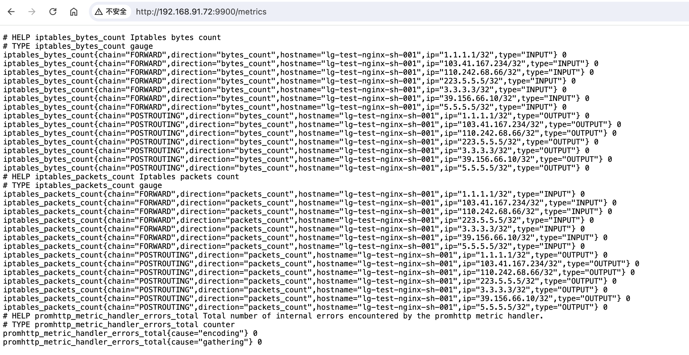
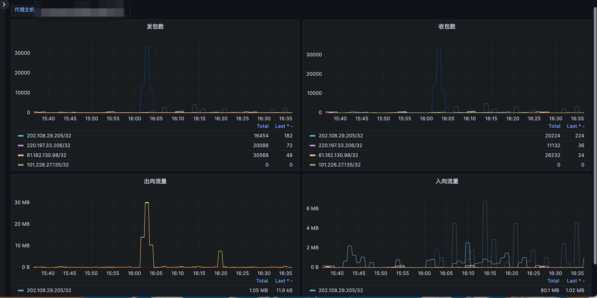

# 动态出网代理

本项目是一个基于iptables的动态防火墙系统，主要用于处理动态变化的域名和IP地址，以满足不允许线上随意访问公网的需求，同时自动化管理外网访问规则，提高效率。

## 系统组件

1. Server

	•	Web Interface：提供一个网页界面，可以通过该界面添加或删除需要访问的域名和IP地址。
	•	API Interface：提供API接口，可以通过API方式添加或删除域名和IP地址。
	•	WSS Interface：提供WebSocket接口，允许Gateway注册并接受任务。
	•	Domain Resolver：每分钟自动解析添加的域名，如果A记录有变化则自动更新iptables规则。

2. Gateway

	•	IPTables Manager：运行在有完全互联网权限的机器上，接收Server发布的添加/删除任务并添加到iptables。
	•	Prometheus Exporter：统计每个IP的收发流量，并将数据暴露给Prometheus进行监控。

3. Route

	•	Route Manager：运行在任意需要访问外网的机器或K8s Pod中，将所有非内网网段的路由指向Gateway。

## 实现的功能
 - server
   - 提供API/页面添加/删除 域名/ip
   - 每分钟自动解析添加的域名，如出现新的A记录自动发布给gateway
   - 如果添加时指定了不可删除，则后不能删除
   - 拒绝内网ip的添加
   - server端可以随意故障
 - gateway
   - 通过wss接口注册到server端接收server端发布的添加/删除任务
   - 计算统计并暴露metrics
   - 具有幂等性，不会重复添加
   - gateway在server端故障时会自动尝试重连
   - 只允许由server端发布的ip经过代理访问
   - 检查添加的ip是否为内网ip，如果是内网ip则跳过

 - route
   - 将所有公网ip网段的路由指向gateway

## 数据流

	1.	用户通过Web Interface或API Interface与Server交互。
        •	用户 → 🖥️ Web Interface
        •	用户 → 🔗 API Interface
	2.	Server通过WSS Interface将任务发布给Gateway。
        •	🖥️ Web Interface → 🌐 WSS Interface
        •	🔗 API Interface → 🌐 WSS Interface
	3.	Gateway通过IPTables r执行任务，并将流量统计数据通过Prometheus Exporter暴露。
        •	🌐 WSS  → 🚦 IPTables
        •	🚦 IPTables → 📊 Prometheus Exporter
	4.	需要访问外网的机器通过Route 将外部流量路由到Gateway进行管理。
        •	🛤️ Route → 🚦 IPTables

## 参数说明

| 参数名称               | 作用                                           | 适用范围 | 是否必须 |
|------------------------|------------------------------------------------|----------|----------|
| `-iptables-gateway`    | gateway 的 IP 地址，用以将公网 IP 路由至该地址  | route    | 是       |
| `-iptables-wss-server` | server 端的地址，用以从 server 端接收添加/删除任务 | gateway  | 是       |
| `-server-conf-path`    | 指定 server 端配置文件的路径                    | server   | 是       |

### server端的config文件
把下面的配置以yaml格式保存在server的任意目录中，通过-server-conf-path参数指定即可
- db_user: "your_db_user"
- db_password: "your_db_password"
- db_server: "your_db_server"
- db_port: "your_db_port"
- db_name: "your_db_name"

## 项目截图
### server端截图

### exporter的指标

### grafana展示

## metric说明
| 名称                   | 作用                             |
|------------------------|---------------------------------|
| `iptables_bytes_count`    | 统计每个ip input/output的带宽  |
| `iptables_packets_count` | 统计每个ip input/output的报文数 |

### grafana中展示的语句（参考即可）
#### ip OUTPUT报文数
- sum by (ip) (increase(iptables_packets_count{type=~"OUTPUT",hostname=~"$host"}[2m]))
#### ip INPUT报文数
- sum by (ip) (increase(iptables_packets_count{type=~"INPUT",hostname=~"$host"}[2m]))
#### ip 产生的OUTPUT流量
sum by (ip) (increase(iptables_bytes_count{type=~"OUTPUT",hostname=~"$host"}[2m]))
#### ip 产生的INPUT流量
sum by (ip) (increase(iptables_bytes_count{type=~"INPUT",hostname=~"$host"}[2m]))

## 运行方式
 - 进入cmd目录，自行build三个组件即可
 - 支持虚拟机/k8s的部署方式，只要三端能互相访问即可
 - 建议将server端运行在k8s中，gateway连接server的svc地址
 - 如果需要将route运行在k8s中，请在yaml中开启hostnetwork
 - 建议将gateway运行在拥有完全互联网权限的主机中，以二进制的形式部署

## 已在生产中稳定运行很久，如果您有任何问题，欢迎提Issues